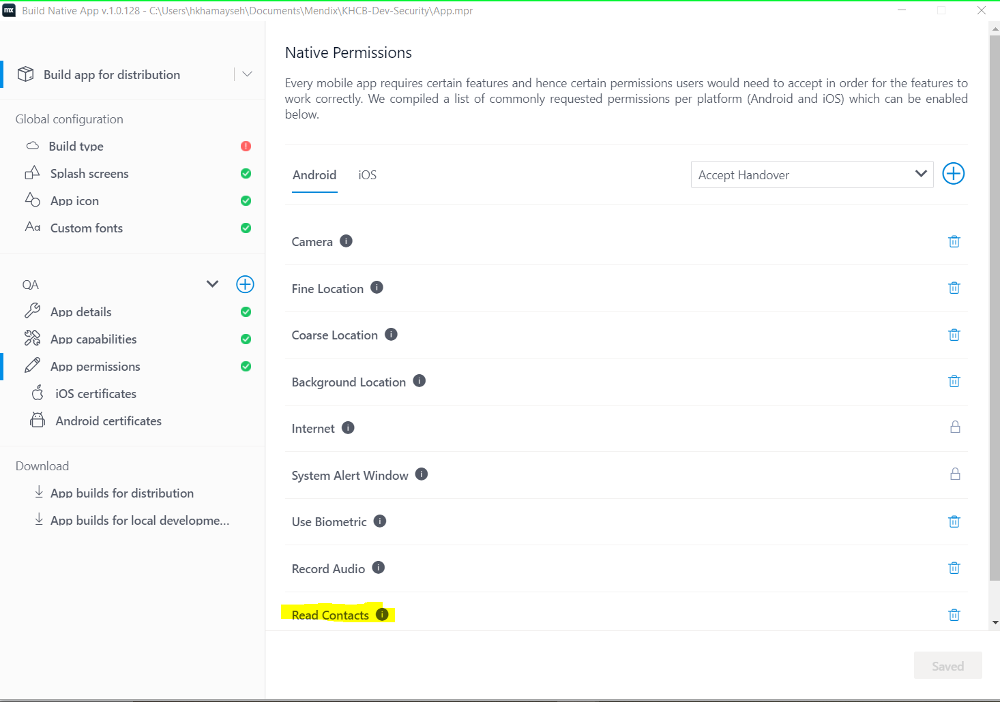
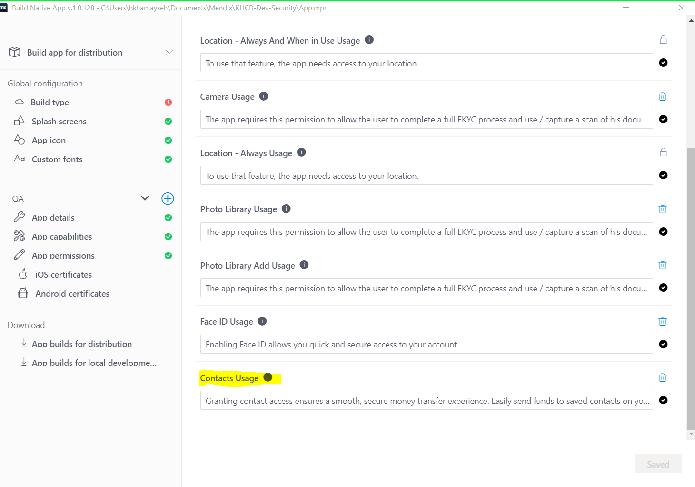

# Contact Picker

**Overview**

Provide an overview documentation for implementing a Contact Picker in Mendix for native iOS and Android platforms.

## 1. Include the Permission
 
1. For Android support, make sure your `AndroidManifest.xml` file includes permission to read contacts along with a query intent for Android 11+

    ```xml
    <manifest>
        <!-- Add this for overall Android support -->
        <uses-permission android:name="android.permission.READ_CONTACTS" />
        <application>
            ...
        </application>

        <!-- Also add this for Android 11+ support -->
        <queries>
            <intent>
                <action android:name="android.intent.action.VIEW" />
                <category android:name="android.intent.category.DEFAULT" />
                <data android:mimeType="vnd.android.cursor.dir/contact" />
            </intent>
        </queries>
    </manifest>
    ```

    For iOS support, make sure to include usage description for contacts in your `Info.plist` file:

    ```xml
    <?xml version="1.0" encoding="UTF-8"?>
    <!DOCTYPE plist PUBLIC "-//Apple//DTD PLIST 1.0//EN" "http://www.apple.com/ DTDs/PropertyList-1.0.dtd">
    <plist version="1.0">
    <dict>
        ...
    	<key>NSContactsUsageDescription</key>
    	<string>THis app uses your contacts to....</string>
        ...
    </dict>
    </plist>
    ```

2. Add Mendix native permissions for Android and IOS:
  
  


## 2. Installing Dependencies

* Move path `[project-name]\javascriptsource\[module-name]\actions`
* Start CMD in this location and run the following command:
  
    `$ npm install react-native-select-contact`

## 3. Create JavaScript action

**Parameters**

* None

**Return Value**

* Type: String
* Description: Selected phone number.

**Code**

```JS
// import the the dependencies
import { selectContactPhone } from "react-native-select-contact";
import { PermissionsAndroid, Platform } from "react-native";

async function getPhoneNumber() {

  try {
    const selection = await selectContactPhone();
    if (!selection) {
      return null;
    }
    let { selectedPhone } = selection;
    return selectedPhone.number;

  } catch (err) {
    throw new Error("err.message", err.message);
  }

}
```

## 4. Creating the Nanoflow  


## Author

* Hala Khamayseh
* Aseel Dweidar
* Noureddin Khalaf

> Feel free to customize this template according to your specific requirements and the details of your JavaScript action.